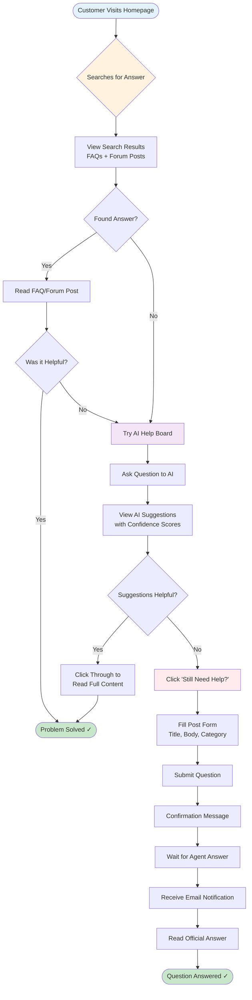
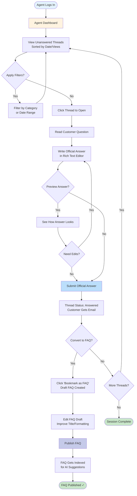
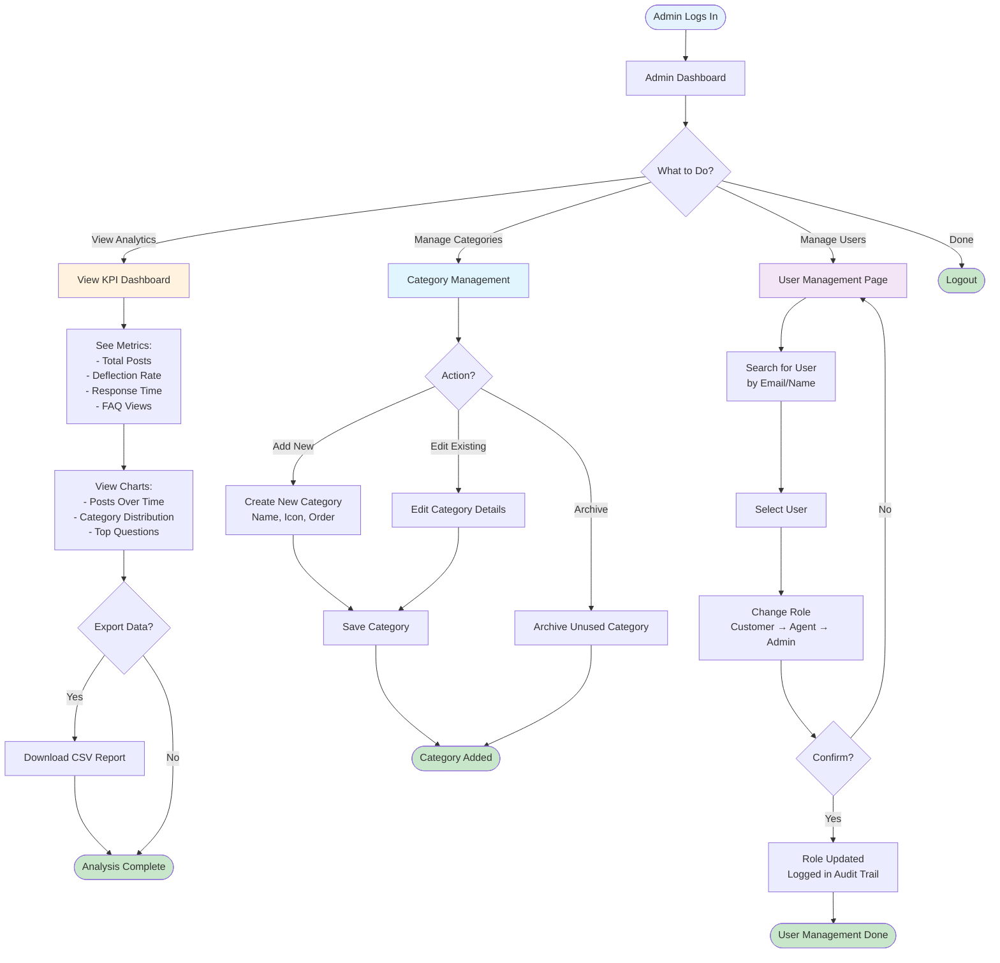
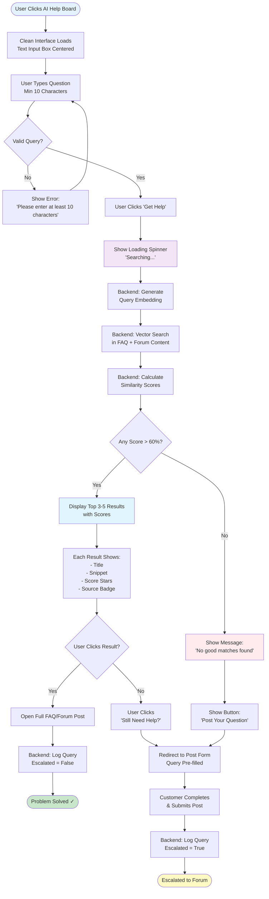

# USER FLOW DIAGRAMS
## Customer Care Forum + AI Help Board

These diagrams show how different users navigate through the system.

---

## CUSTOMER FLOW

View Mermaid Code

---

## AGENT FLOW

View Mermaid Code

---

## ADMIN FLOW

View Mermaid Code

---

## AI HELP BOARD DETAILED FLOW

View Mermaid Code

