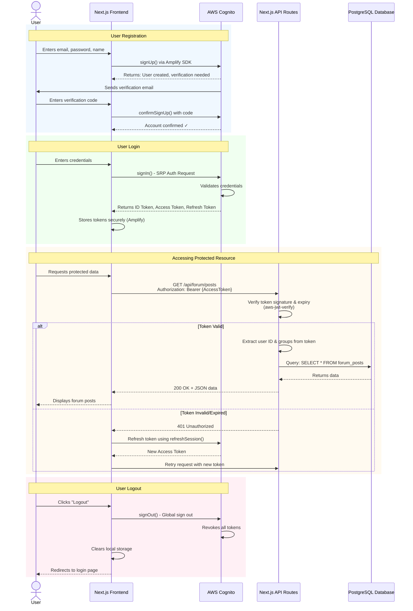

# Authentication Flow Document
## Somba Customer Care Forum - AWS Cognito Authentication

**Author:** Yashu Gautamkumar Patel
**Date:** December 3, 2025
**Phase:** 3 - Technical Research
**Status:** Research & Planning Document (Implementation Pending)

---

## Overview

This document outlines the **planned authentication and authorization system** for the Customer Care Forum, designed to utilize **AWS Cognito** for a fully managed, secure, and scalable identity solution.

**Note:** This is a research and planning document created during Phase 3 (Weeks 5-6). Actual AWS Cognito setup and implementation will begin in January 2026 (Phase 4).

---

## Visual Flow

This diagram illustrates the **planned authentication flow** showing how users will be authenticated via AWS Cognito and how tokens will be used to access the backend API.

### Authentication Flow Diagram


**Figure 1:** Complete authentication flow showing Registration, Login, Protected Resource Access, and Logout processes. The diagram shows four color-coded sections:
- 🟢 **Green**: User Registration (email verification flow)
- 🟠 **Orange**: User Login (token generation)
- 🔵 **Blue**: Accessing Protected Resources (API authentication)
- 🔴 **Pink**: User Logout (token revocation)

---

### Mermaid Sequence Diagram (For GitHub Rendering)



### Text-Based Flow Diagram (Alternative)

For easier viewing, here's a simplified text representation:

```
┌─────────────────────────────────────────────────────────────┐
│                     AUTHENTICATION FLOW                      │
└─────────────────────────────────────────────────────────────┘

1️⃣  REGISTRATION
    User                 Browser              AWS Cognito
     │                      │                      │
     │──── Enter email ────>│                      │
     │      & password      │                      │
     │                      │──── signUp() ───────>│
     │                      │                      │
     │                      │<─── User created ────│
     │<──── Email with ─────┤                      │
     │   verification code  │                      │
     │                      │                      │
     │── Enter code ───────>│                      │
     │                      │─ confirmSignUp() ───>│
     │                      │<─── Confirmed ✓ ─────│
     │                      │                      │

2️⃣  LOGIN
    User                 Browser              AWS Cognito
     │                      │                      │
     │── Enter creds ──────>│                      │
     │                      │─ signIn() (SRP) ────>│
     │                      │                      │
     │                      │<─── ID Token ────────│
     │                      │     Access Token     │
     │                      │     Refresh Token    │
     │                      │                      │
     │                      │ (Store securely)     │
     │                      │                      │

3️⃣  ACCESSING PROTECTED DATA
    Browser              API Routes           Database
       │                      │                    │
       │─── GET /api/posts ──>│                    │
       │  Bearer {token}      │                    │
       │                      │                    │
       │                      │ Verify token       │
       │                      │ (signature, exp)   │
       │                      │                    │
       │                      │── SELECT posts ───>│
       │                      │<── Returns data ───│
       │<─── 200 OK + data ───│                    │
       │                      │                    │

4️⃣  TOKEN REFRESH (Automatic)
    Browser              AWS Cognito
       │                      │
       │ (Access token        │
       │  expired)            │
       │                      │
       │─ refreshSession() ──>│
       │                      │
       │<─ New Access Token ──│
       │                      │
       │ (Retry API call)     │
       │                      │

5️⃣  LOGOUT
    Browser              AWS Cognito
       │                      │
       │──── signOut() ──────>│
       │                      │
       │                      │ Revoke all tokens
       │                      │
       │<── Logged out ───────│
       │                      │
       │ Clear local storage  │
       │                      │
```

---

## Authentication Strategy

### Why AWS Cognito?

**Advantages:**
- **Fully Managed:** No need to maintain authentication servers or handle sensitive password hashing logic manually.
- **Security:** Built-in protection against brute force, compromised credential checks, and support for MFA.
- **Scalability:** Automatically scales to millions of users.
- **Standards Compliant:** Implements OAuth 2.0 and OpenID Connect (OIDC) standards.
- **Integration:** Seamlessly integrates with AWS Amplify and other AWS services.

---

## Token Types

Cognito returns three types of tokens (JWTs):

### ID Token
- **Purpose:** Contains claims about the identity of the authenticated user (name, email, phone_number).
- **Usage:** Used by the frontend to display user profile information.
- **Expiration:** 1 hour (default).

### Access Token
- **Purpose:** Authorize access to protected resources.
- **Usage:** Sent in the `Authorization` header to the backend API.
- **Contains:** Scopes and groups (roles).
- **Expiration:** 1 hour (default).

### Refresh Token
- **Purpose:** Obtain new ID and Access tokens.
- **Usage:** Handled automatically by the Amplify SDK.
- **Expiration:** 30 days (configurable).

---

## User Roles

Roles are managed using **Cognito User Groups**.

### Role Hierarchy

```
Admin (Cognito Group: 'Admins')
  ↓
Agent (Cognito Group: 'Agents')
  ↓
Customer (Default / No Group)
```

### Permissions by Role

| Action | Customer | Agent | Admin |
|--------|----------|-------|-------|
| Search FAQs/Forum | ✅ | ✅ | ✅ |
| Post questions | ✅ | ✅ | ✅ |
| View own posts | ✅ | ✅ | ✅ |
| Provide official answers | ❌ | ✅ | ✅ |
| Lock/close threads | ❌ | ✅ | ✅ |
| Create/edit FAQs | ❌ | ✅ | ✅ |
| Convert answer → FAQ | ❌ | ✅ | ✅ |
| View analytics | ❌ | ❌ | ✅ |
| Manage users | ❌ | ❌ | ✅ |

---

## Authentication Flows

All flows are implemented using the **AWS Amplify Auth Library** on the frontend.

### 1. User Registration

```typescript
import { signUp } from 'aws-amplify/auth';

await signUp({
  username: 'user@example.com',
  password: 'SecurePassword123!',
  options: {
    userAttributes: {
      email: 'user@example.com',
      name: 'Jane Doe'
    }
  }
});
```

**Flow:**
1. User enters details.
2. Amplify sends request to Cognito User Pool.
3. Cognito sends verification code to email.
4. User enters code to confirm account.

### 2. User Login

```typescript
import { signIn } from 'aws-amplify/auth';

await signIn({ 
  username: 'user@example.com', 
  password: 'SecurePassword123!' 
});
```

**Flow:**
1. User enters credentials.
2. Amplify performs Secure Remote Password (SRP) protocol handshake.
3. Cognito returns tokens upon success.

### 3. Token Refresh

Handled automatically by Amplify. When the Access Token expires, Amplify uses the Refresh Token to silently fetch a new session.

### 4. Logout

```typescript
import { signOut } from 'aws-amplify/auth';

await signOut();
```

**Flow:**
1. Amplify clears local storage.
2. Revokes tokens in Cognito (if global sign-out is selected).

---

## Backend Verification

The backend (Next.js API Routes) must verify the Access Token before processing requests.

### Middleware Implementation

Using `aws-jwt-verify` library:

```typescript
import { CognitoJwtVerifier } from "aws-jwt-verify";

// Create verifier
const verifier = CognitoJwtVerifier.create({
  userPoolId: process.env.COGNITO_USER_POOL_ID,
  tokenUse: "access",
  clientId: process.env.COGNITO_CLIENT_ID,
});

export const authenticate = async (req, res, next) => {
  try {
    const token = req.headers.authorization?.split(' ')[1];
    if (!token) throw new Error("No token");

    // Verify token (checks signature, expiration, issuer)
    const payload = await verifier.verify(token);
    
    // Attach user info to request
    req.user = {
      id: payload.sub,
      groups: payload['cognito:groups'] || []
    };
    
    next();
  } catch (err) {
    res.status(401).json({ error: "Unauthorized" });
  }
};
```

### Role-Based Access Control

```typescript
export const requireRole = (role) => (req, res, next) => {
  if (req.user.groups.includes(role) || req.user.groups.includes('Admins')) {
    next();
  } else {
    res.status(403).json({ error: "Forbidden" });
  }
};
```

---

## Security Best Practices

### 1. Zero Knowledge Password Proof
Cognito uses the SRP protocol, meaning passwords are never sent over the wire during authentication.

### 2. Token Security
- Tokens are stored securely by the Amplify client.
- Access tokens are short-lived (1 hour).

### 3. Password Policies
Configured in Cognito Console:
- Min length: 8
- Requires numbers, special characters, uppercase, lowercase.

### 4. Advanced Security (Optional)
- Multi-Factor Authentication (MFA).
- Adaptive Authentication (blocks suspicious IPs).

---

## Implementation Checklist (Planned for Phase 4 - January 2026)

- [ ] Create AWS account and enable Cognito service
- [ ] Create Cognito User Pool in AWS Console
- [ ] Create App Client (enable SRP, no client secret for web)
- [ ] Create User Groups (Admins, Agents)
- [ ] Initialize Next.js project and install AWS Amplify dependencies
- [ ] Configure Amplify in Next.js app (`Amplify.configure()`)
- [ ] Implement Sign Up / Sign In forms using Amplify UI or SDK
- [ ] Install `aws-jwt-verify` in backend
- [ ] Create backend middleware to verify tokens
- [ ] Test all flows (Register, Login, Protected Route, Logout)

---

**Version:** 1.0 (Research Phase)
**Last Updated:** December 3, 2025
**Status:** Research & Planning Complete - Implementation Planned for January 2026
