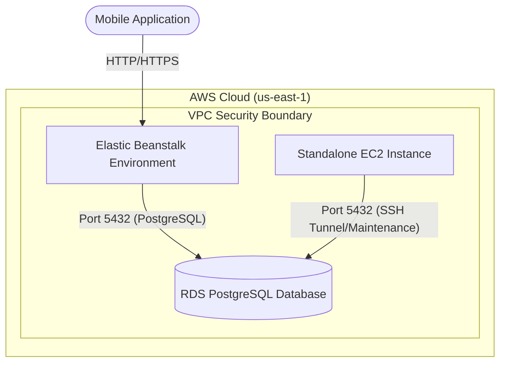

# Osomba Marketplace: AWS Infrastructure Documentation

This document outlines the AWS infrastructure architecture for the Osomba Marketplace backend. It explains how the components (Mobile App, Backend, Database) are connected and secured.

## 1. High-Level Architecture Diagram

## 2. Infrastructure Components

### A. Backend Application (Elastic Beanstalk)
*   **Resource Name:** `osomba-marketplace-env`
*   **Platform:** Python 3.11 with Gunicorn/Uvicorn (FastAPI)
*   **Role:** Hosting the core API logic.
*   **Connectivity:**
    *   **Inbound:** Accepts HTTP traffic from the public internet (Mobile App).
    *   **Outbound:** Connects to the RDS database to store/retrieve data.

### B. Database (RDS)
*   **Resource Name:** `osomba-marketplace-db`
*   **Engine:** PostgreSQL 16.3
*   **Endpoint:** `osomba-marketplace-db.cyxecuk22kgr.us-east-1.rds.amazonaws.com`
*   **Role:** Persistent storage for user data, listings, messages, etc.
*   **Security:** **NOT PUBLICLY ACCESSIBLE.** It resides in a private subnet group and is protected by strict Security Group rules.

### C. Authentication & Infrastructure (Amplify Gen 2)
*   **Service:** AWS Cognito
*   **Role:** Authoritative system of record for user identity (Passwords, MFA, JWT issuance).
*   **Infrastructure Management:** Managed via **Amplify Gen 2** code located in `mobile/amplify/`.
*   **Triggers:** Includes a `customMessage` Lambda trigger for branded HTML emails.

### D. Management Server (EC2)
*   **Resource Name:** `osomba-marketplace-inst`
*   **Instance Type:** `t3.micro`
*   **Role:** "Jump Box" or Bastion Host.
*   **Usage:** Used by developers to:
    1.  SSH into the private network.
    2.  Run manual database migration scripts (Alembic).
    3.  Connect to the database using command-line tools (`psql`) for debugging.

## 3. Network & Security Groups

The security of the system relies on **Security Groups (Firewalls)** that explicitly allow traffic only where necessary.

| Security Group Name | Attached To | Inbound Rules | Purpose |
| :--- | :--- | :--- | :--- |
| **`osomba-marketplace-eb-sg`** | Elastic Beanstalk (Load Balancer/EC2) | **Port 80 (HTTP):** `0.0.0.0/0` (Anywhere) | Allow public internet user traffic to reach the API. |
| **`osomba-marketplace-ec2-sg`** | Standalone EC2 Instance | **Port 22 (SSH):** `0.0.0.0/0` (Restricted via Key Pair) | Allow developers to SSH in for maintenance. |
| **`osomba-marketplace-rds-sg`** | RDS Database | **Port 5432 (PostgreSQL):** 1. From `osomba-marketplace-eb-sg` 2. From `osomba-marketplace-ec2-sg` 3. From EB Default SG (`sg-02aac...`) | **Crucial:** Only allows DB connections from the Backend App and the Management Server. Blocks all public internet access. |

## 4. Connection Details

### Mobile App -> Backend
The mobile app behaves as a public client. It connects to the backend using the Elastic Beanstalk URL found in `mobile/lib/utils/constants.dart`.

### Backend -> Database
The backend application code connects to the database using credentials stored in the **Environment Variables** of the Elastic Beanstalk configuration:
*   `POSTGRES_SERVER`: The RDS Endpoint.
*   `POSTGRES_USER`: Database username.
*   `POSTGRES_PASSWORD`: Database password.
*   `POSTGRES_DB`: The specific database name (`osomba`).

## 5. Why This Architecture?
1.  **Security:** The database is isolated. Even if someone finds the database URL, they cannot connect because the Security Group blocks all traffic except from your trusted AWS resources.
2.  **Scalability:** Elastic Beanstalk can scale the web servers (EC2 instances) up or down based on traffic, while keeping the database stable.
3.  **Maintainability:** The Standalone EC2 instance provides a safe way to perform upgrades or fixes without taking down the main web server.

---

## 6. Detailed Infrastructure Registry

### EC2 Instance (Management)
- **Instance ID:** `i-05bf0f6775d09df8e`
- **Public IP:** `54.152.166.203`
- **Private IP:** `172.31.26.15`
- **Instance Type:** `t3.micro`
- **Key Pair:** `osomba-marketplace-key.pem`

### RDS Database (Production/Staging)
- **DB Identifier:** `osomba-marketplace-db`
- **Endpoint:** `osomba-marketplace-db.cyxecuk22kgr.us-east-1.rds.amazonaws.com`
- **Port:** `5432`
- **Engine:** PostgreSQL 16.3
- **Instance Class:** `db.t4g.micro`
- **Storage:** 20 GB (encrypted)

### Security Groups
- **RDS SG:** `sg-0695268a35fadee27` (osomba-marketplace-rds-sg)
- **EB SG:** `sg-02aac38ae871da7e0`

